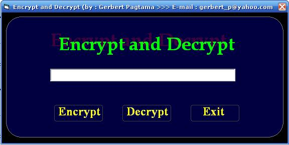



## Encrypt and Decrypt

### Description

this program is use for Encrypt and Decrypt,..

so that you can use this program for password or hide your important information, using this kind of program,..
 
### More Info
 

             |
---                |---
**Submitted On**   |2007-05-31 06:16:10
**By**             |[Gerbert Pagtama](https://github.com/Planet-Source-Code/PSCIndex/blob/master/ByAuthor/gerbert-pagtama.md)
**Level**          |Beginner
**User Rating**    |3.7 (22 globes from 6 users)
**Compatibility**  |VB 3\.0, VB 4\.0 \(16\-bit\), VB 4\.0 \(32\-bit\), VB 5\.0, VB 6\.0
**Category**       |[Encryption](https://github.com/Planet-Source-Code/PSCIndex/blob/master/ByCategory/encryption__1-48.md)
**World**          |[Visual Basic](https://github.com/Planet-Source-Code/PSCIndex/blob/master/ByWorld/visual-basic.md)
**Archive File**   |[Encrypt\_an2068415312007\.zip](https://github.com/Planet-Source-Code/gerbert-pagtama-encrypt-and-decrypt__1-68717/archive/master.zip)

